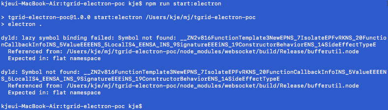
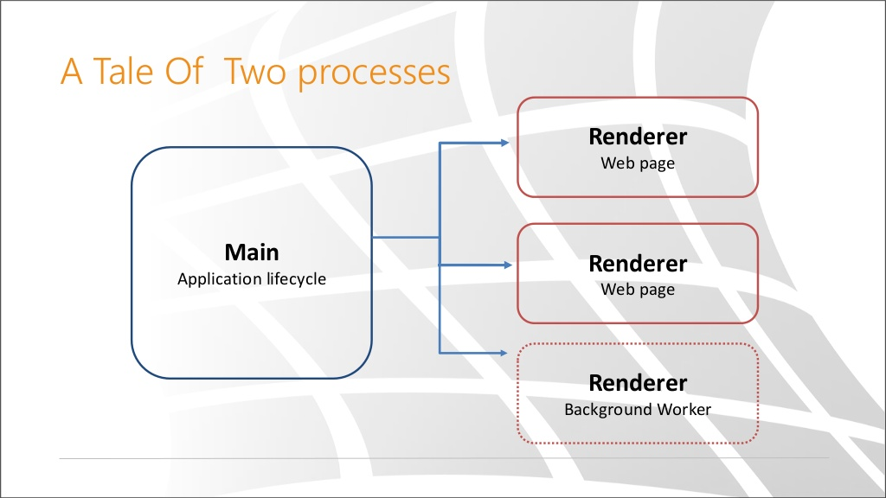
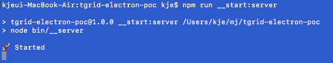

## I am anxiously waiting for samchon help.



```bash
dyld: lazy symbol binding failed: Symbol not found: __ZN2v816FunctionTemplate3NewEPNS_7IsolateEPFvRKNS_20FunctionCallbackInfoINS_5ValueEEEENS_5LocalIS4_EENSA_INS_9SignatureEEEiNS_19ConstructorBehaviorENS_14SideEffectTypeE
  Referenced from: /Users/kje/mj/tgrid-electron-poc/node_modules/websocket/build/Release/bufferutil.node
  Expected in: flat namespace

dyld: Symbol not found: __ZN2v816FunctionTemplate3NewEPNS_7IsolateEPFvRKNS_20FunctionCallbackInfoINS_5ValueEEEENS_5LocalIS4_EENSA_INS_9SignatureEEEiNS_19ConstructorBehaviorENS_14SideEffectTypeE
  Referenced from: /Users/kje/mj/tgrid-electron-poc/node_modules/websocket/build/Release/bufferutil.node
  Expected in: flat namespace
```

`src/electron/main.ts`
- https://github.com/myungjaeyu/tgrid-electron-poc/blob/hotfix-web-conn/src/electron/main.ts

```ts
    /* Hack
    */
    const connector = new WebConnector()

    await connector.connect('ws://127.0.0.1:10101')
    await connector.wait()

    const exam : Driver<IExam> = connector.getDriver<IExam>()

    console.log(await exam.send('u4bi'))

    await connector.close()
```




## Usage

```bash
$ git clone -b hotfix-web-conn https://github.com/myungjaeyu/tgrid-electron-poc.git

$ npm install
$ npm run build

$ npm run __start:server

$ npm run start:electron
```

`src/__server.ts`
- https://github.com/myungjaeyu/tgrid-electron-poc/blob/hotfix-web-conn/src/__server.ts

